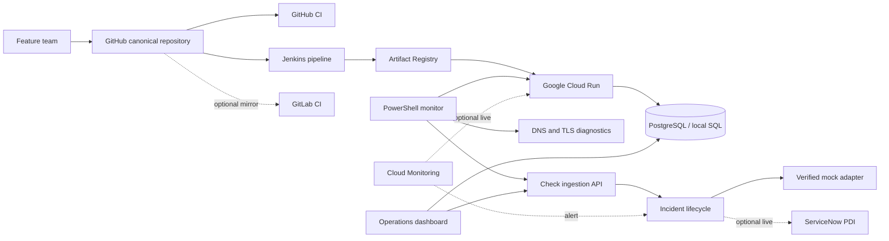

# Production Reliability & Incident Automation Platform

[](https://github.com/dishasingh5422/production-reliability-incident-platform/actions/workflows/ci.yml)

> A reproducible production-support simulation with a live operations dashboard that detects service degradation, creates one traceable incident, verifies recovery, and turns the failure into an operational improvement.

**Verified locally:** 19 automated tests · 93% coverage · live operations dashboard · Docker Compose · PostgreSQL · PowerShell synthetic monitoring · controlled failure and recovery<br>
**Verified remotely:** GitHub CI quality/test and Linux container-build jobs<br>
**Prepared but not claimed as live:** Jenkins, GitLab mirror, Google Cloud Run/Monitoring, and ServiceNow PDI

This is a portfolio simulation using synthetic operational records. It does not represent NatWest, another bank, a customer environment, or production service levels.

## The 60-second tour

| Production-support question | Implemented answer |
|---|---|
| What needs attention now? | Auto-refreshing control room with service state, check pass rate, latency, incidents, MTTR, deployment evidence, and filters |
| Is the process alive? | Dependency-free `GET /healthz` |
| Can it serve traffic safely? | PostgreSQL-aware `GET /readyz` with safe diagnostic codes |
| What changed? | Version, environment, deployment-event model, commit-SHA evidence |
| How is it monitored? | Prometheus metrics plus PowerShell HTTP, DNS, TLS, latency, and readiness checks |
| What happens on repeated failures? | Deterministic deduplication updates one open incident |
| When is recovery trusted? | Incident resolves only after two consecutive healthy checks |
| Can a release be controlled? | Quality gates, container smoke test, Jenkins deployment parameter, and rollback script |
| Can an operator learn from the failure? | Runbook, timeline, RCA, preventive action, and JD evidence map |

## Architecture



## Verified findings

The latest verification performed on 12 September 2026 produced:

- 19 passing automated tests in 0.20 seconds.
- 93.24% measured branch-aware application coverage, rounded to 93% in summaries.
- Successful Ruff, strict MyPy, Bandit, Compose validation, Python compilation, and Linux container build.
- Healthy PostgreSQL and application containers.
- Successful container smoke test covering the dashboard, dashboard data API, health, readiness, metrics, access control, incident deduplication, recovery threshold, and resolution.
- A PowerShell monitor result with DNS addresses, HTTP 200, and measured 28.38 ms response time in the healthy baseline.
- A controlled readiness failure detected by PowerShell as HTTP 503 with critical exit code 2.
- One high-severity incident created, then resolved after two consecutive healthy checks.
- Approximate local-simulation MTTD of 1.37 seconds and MTTR of 2.96 seconds.

These timings describe a same-machine controlled drill, not a production SLA or performance benchmark.

## Quickstart

### Python and SQLite

```bash
python3.11 -m venv .venv
source .venv/bin/activate
python -m pip install -e '.[dev]'
uvicorn app.main:app --host 127.0.0.1 --port 8080
```

Open the operations dashboard at `http://127.0.0.1:8080/dashboard`. The interactive API documentation remains available at `http://127.0.0.1:8080/docs`.

### Docker Compose and PostgreSQL

```bash
docker compose up --build -d
docker compose ps
./scripts/smoke-test.sh
```

Stop the stack without deleting the PostgreSQL volume:

```bash
docker compose down
```

## Core endpoints

| Method | Endpoint | Purpose |
|---|---|---|
| GET | `/dashboard` | Responsive live operations control room |
| GET | `/api/dashboard` | Bounded operational summary for the dashboard |
| GET | `/healthz` | Process liveness without dependency coupling |
| GET | `/readyz` | Database-backed traffic readiness |
| GET | `/metrics` | Prometheus-compatible operational metrics |
| GET | `/api/status` | Version, state, latest check/deployment, and open incidents |
| POST | `/api/checks` | Ingest a structured synthetic-monitor result |
| GET | `/api/incidents` | List or filter incidents |
| POST | `/ops/faults/{mode}` | Activate guarded latency, error, or readiness fault |
| POST | `/ops/recover` | Remove the controlled fault |

Fault injection is disabled by default. It requires both `ENABLE_FAULT_INJECTION=true` and the `x-admin-token` header.

## Operations dashboard

The dashboard refreshes every 15 seconds and displays the current service state, 24-hour synthetic-check pass rate, average timed-check response, open incidents by severity, average incident MTTR, response-time trend, recent incidents, deployment evidence, and filterable checks. Each refresh records a real readiness observation. It uses no external analytics or chart service and does not expose the local fault-injection token.

The check pass rate is not presented as production availability: it includes controlled monitoring results from the local simulation. See the [dashboard guide](docs/dashboard.md) for metric definitions and demonstration steps.

## PowerShell monitoring

On a host with PowerShell 7:

```powershell
./scripts/Monitor-Service.ps1 `
  -ServiceUrl http://127.0.0.1:8080 `
  -LatencyThresholdMs 500
```

The script resolves the service hostname, checks HTTPS/TCP connectivity and TLS expiry when applicable, calls health and readiness, measures latency, posts a structured result, and manages one deduplicated incident. It exits 0 for healthy, 1 for warning, or 2 for critical.

The verified run used the official PowerShell Linux container because PowerShell was not installed on the host:

```bash
docker run --rm --platform linux/amd64 \
  --volume "$PWD:/workspace:ro" \
  mcr.microsoft.com/powershell:lts-alpine-3.20 \
  pwsh -NoLogo -NoProfile \
  -File /workspace/scripts/Monitor-Service.ps1 \
  -ServiceUrl http://host.docker.internal:8080 \
  -ExpectedDnsName host.docker.internal
```

## Quality and CI/CD

```bash
make verify
docker compose config --quiet
docker build --tag production-reliability-platform:local .
```

- GitHub CI runs lint, strict types, security checks, tests with an 80% coverage gate, Compose validation, and Linux container build on every push and pull request.
- `Jenkinsfile` defines checkout, parallel quality gates, JUnit/coverage evidence, container build, smoke test, gated Cloud Run deployment, and cleanup.
- `.gitlab-ci.yml` defines secondary quality, test, and container-configuration jobs for a future GitLab mirror.
- Jenkins and GitLab files are implemented but are not labelled runtime-verified.

## Cloud and ServiceNow integrations

- [GCP deployment and monitoring](docs/gcp-deployment.md)
- [ServiceNow PDI setup](docs/servicenow-setup.md)
- The mock incident adapter is the verified local baseline.
- GCP and live ServiceNow remain pending until authenticated environments are available.

## Operational documentation

- [Architecture and design decisions](docs/architecture.md)
- [Operations dashboard guide](docs/dashboard.md)
- [Operations runbook](docs/operations-runbook.md)
- [Incident management](docs/incident-management.md)
- [Release and rollback](docs/release-and-rollback.md)
- [Controlled incident RCA](docs/rca/incident-001.md)
- [Security and limitations](docs/security-and-limitations.md)
- [NatWest JD evidence map](docs/jd-evidence-map.md)
- [Recruiter walkthrough](docs/recruiter-walkthrough.md)

## Repository structure

```text
app/                  FastAPI, dashboard, persistence, metrics, fault and incident logic
database/             PostgreSQL schema and production-support SQL
tests/                Unit, integration and API contract tests
scripts/              PowerShell monitor, smoke, deploy, rollback and teardown
monitoring/           Cloud Monitoring example resources
docs/                 Runbooks, RCA, evidence map and integration guides
evidence/             Verified summary; runtime artifacts remain ignored
Jenkinsfile           Gated Jenkins deployment pipeline
.gitlab-ci.yml         Secondary GitLab validation pipeline
.github/workflows/     Verified canonical GitHub CI
```

## Limitations

- The incident timings are generated by a controlled local simulation.
- The mock incident adapter proves lifecycle logic but is not ServiceNow runtime evidence.
- GCP files do not prove a live deployment; authenticated Cloud Run and Monitoring evidence is pending.
- The default Cloud Run script uses local SQLite unless persistent storage is configured; it is a portfolio demo, not production persistence.
- Geneos is not implemented and is not claimed.
- No availability, efficiency, loss-prevention, or customer-impact claim is made.

## License

MIT License. See [LICENSE](LICENSE).
