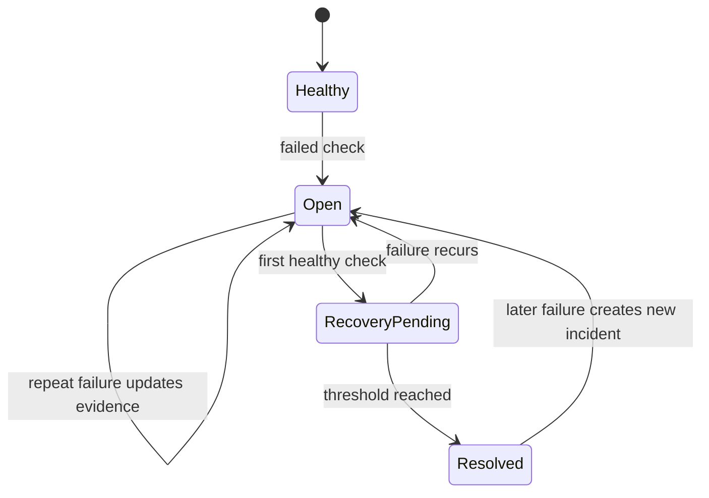

# Incident management

## Lifecycle

## Deduplication and recovery

The key is SHA-256 of lowercase service, check type, and target. An incident is reused only while `OPEN` or `ACKNOWLEDGED`. The default recovery threshold is two consecutive healthy checks; another failure resets the counter.

## Provider boundary

`MockIncidentClient` is fully tested. `ServiceNowIncidentClient` uses the Table API with environment-loaded credentials. Payload construction is tested through a mock HTTP transport; live ServiceNow execution remains pending.

Severity rules are demonstration assumptions, not bank policy.

